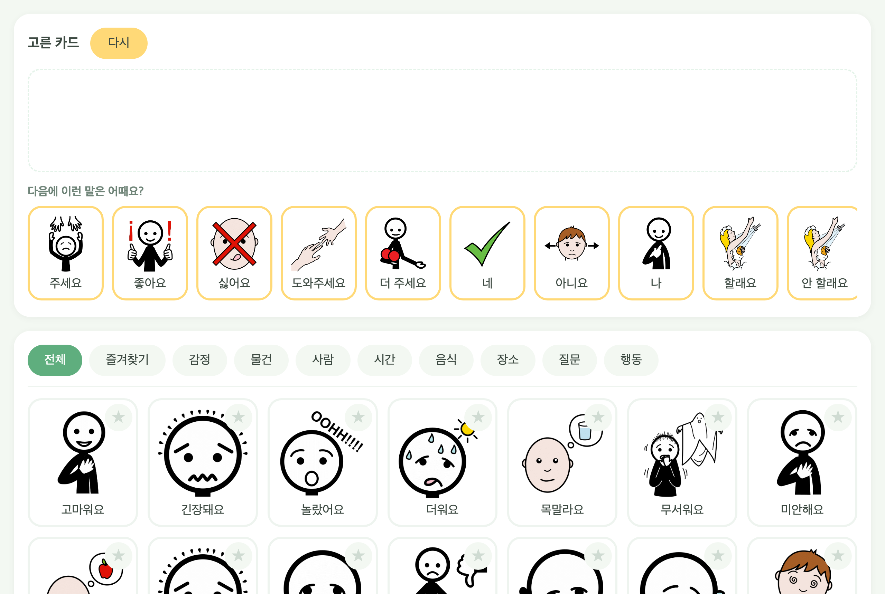
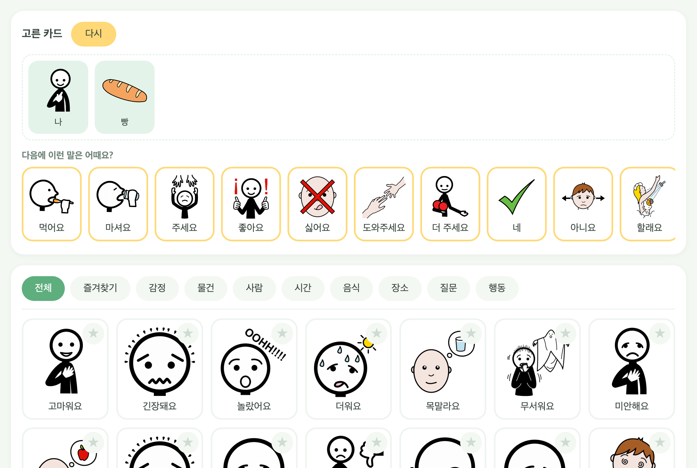
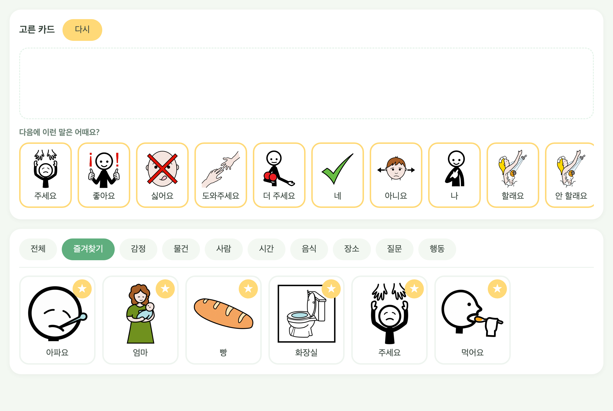
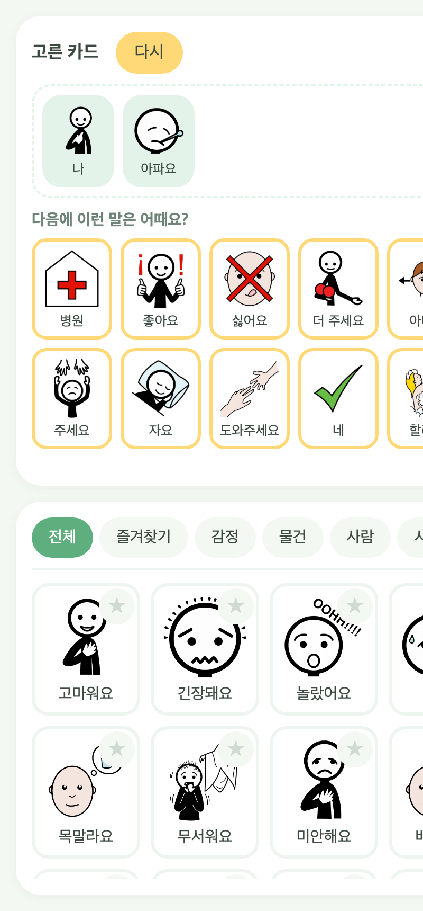

# 말해봐요 — 그림카드로 말하는 웹앱

말이 어려운 아이가 **그림카드를 눌러 하고 싶은 말을 전하는** 앱입니다.
카드를 누르면 소리가 나고, 고른 카드가 위에 줄지어 문장이 됩니다.

설치할 것이 없습니다. 인터넷 주소만 열면 휴대폰·태블릿·컴퓨터에서 바로 씁니다.
**로그인도, 인터넷 연결 중 서버와의 통신도 없습니다.** 모든 것이 기기 안에서 동작합니다.



---

## 바로 쓰기

배포된 주소를 열면 끝입니다. 내 컴퓨터에서 먼저 보려면 `index.html` 파일을 더블클릭하세요.

휴대폰에서 매일 쓴다면 **홈 화면에 추가**해 두면 앱처럼 열립니다.
- 아이폰: 사파리에서 열고 → 공유 버튼 → `홈 화면에 추가`
- 안드로이드: 크롬에서 열고 → 오른쪽 위 점 세 개 → `홈 화면에 추가`

---

## 기능 설명

### 1. 카드를 눌러 말하기

아래쪽 큰 칸에서 카드를 누르면 **그 말이 소리로 나옵니다.** 동시에 위쪽 `고른 카드` 칸에 카드가 쌓입니다.

카드를 차례로 누르면 문장이 됩니다. 예를 들어 `나` → `빵` → `먹어요` 를 누르면
"나 빵 먹어요"를 전할 수 있습니다.



### 2. 고른 카드 빼기 · 처음부터 다시

- **한 장만 빼기** — `고른 카드` 칸에서 그 카드를 누르면 빠집니다. 잘못 누른 카드만 지울 때 씁니다.
- **전부 지우기** — 오른쪽 위 노란 `다시` 버튼을 누르면 고른 카드가 모두 없어집니다.

### 3. 다음에 할 말 추천

`다음에 이런 말은 어때요?` 줄에는 **지금까지 고른 카드에 어울리는 다음 카드**가 나옵니다.
노란 테두리 카드가 추천이고, 여기서 바로 눌러도 소리가 나고 문장에 들어갑니다.

카드를 고르거나 뺄 때마다 추천이 즉시 바뀝니다.

| 고른 카드 | 추천되는 말 |
|---|---|
| (아직 없음) | 주세요, 좋아요, 싫어요, 도와주세요 |
| 나 + 빵 | **먹어요**, 마셔요, 주세요 |
| 나 + 아파요 | **병원**, 자요, 주세요 |
| 나 + 졸려요 | **자요**, 일어나요 |
| 나 + 놀아요 | **같이 해요**, 공, 장난감, 놀이터 |

인터넷으로 무언가를 물어보지 않습니다. 앱 안에 미리 넣어 둔 표만 보고 계산하므로
**비행기 모드에서도, 인터넷이 끊겨도 똑같이 동작합니다.**

### 4. 즐겨찾기 — 자주 쓰는 카드 모으기

카드 오른쪽 위의 **별**을 누르면 노랗게 켜지고, `즐겨찾기` 탭에 모입니다.
아이가 자주 쓰는 말만 모아 두면 찾는 시간이 줄어듭니다. 별을 다시 누르면 빠집니다.

즐겨찾기는 **그 기기의 브라우저에 저장**됩니다. 껐다 켜도 남아 있지만,
다른 기기나 다른 브라우저에는 따라가지 않습니다.



### 5. 카테고리로 찾기

카드가 201장이라 탭으로 나눠 두었습니다.

`전체` · `즐겨찾기` · `감정` · `물건` · `사람` · `시간` · `음식` · `장소` · `질문` · `행동`

### 6. 휴대폰에서

휴대폰에서는 화면이 좁아서 배치가 바뀝니다.

- 추천 카드가 **두 줄**로 깔립니다. 왼쪽이 가장 잘 맞는 추천이고, 옆으로 밀면 더 나옵니다.
- **카드 칸만 따로 스크롤**됩니다. 아래로 아무리 내려도 `고른 카드`와 추천 줄은 화면에 그대로 남습니다.



---

## 카드 추가하기

1. `aac_images/` 안의 원하는 카테고리 폴더에 그림을 넣습니다.
   파일 이름이 그대로 카드 이름이 됩니다. (`aac_images/음식/떡볶이.png` → `떡볶이` 카드)
2. 터미널에서 아래를 실행합니다.

   ```bash
   pip install edge-tts      # 처음 한 번만
   python3 build.py
   ```

`build.py`가 카드 목록(`cards.js`)을 다시 만들고, **음성이 없는 카드만** 골라 소리를 만들어 넣습니다.
이미 있는 음성은 건드리지 않습니다. 전부 다시 만들려면 `python3 build.py --all`.

새 카드를 추천에도 태우려면 `context.js`의 `FRAMES`에서 어울리는 줄에 단어를 추가하세요.
예를 들어 떡볶이는 `"먹기"` 줄 끝에 `,떡볶이`를 붙이면 됩니다. 안 넣어도 카드는 정상 동작합니다.

---

## 인터넷에 올리기 (GitHub Pages)

빌드 과정이 없습니다. 폴더를 그대로 올리면 됩니다.

```bash
git init -b main && git add -A && git commit -m "말해봐요"
gh repo create <저장소이름> --public --source=. --push
```

올린 뒤 GitHub 저장소에서 `Settings` → `Pages` → Source를 `main` / `(root)`로 두면
몇 분 뒤 주소가 나옵니다.

---

## 파일 구조

| 파일 | 하는 일 |
|---|---|
| `index.html` | 화면 뼈대 |
| `style.css` | 색과 배치 (초록·노랑 테마, 휴대폰 대응) |
| `script.js` | 카드 누르기, 소리, 즐겨찾기 |
| `cards.js` | 카드 201장 목록 — `build.py`가 만듦 |
| `context.js` | 추천에 쓰는 표 (쓰임새 태그, 말 순서, 자주 쓰는 말) |
| `recommend.js` | 추천 계산 |
| `build.py` | 카드 목록·음성 만들기 |
| `aac_images/` | 카드 그림 |
| `aac_audios/` | 카드 음성 |

---

## 만든 재료

- **그림** — [ARASAAC](https://arasaac.org) 픽토그램. 저자 Sergio Palao, 제공 [ARASAAC](https://arasaac.org),
  소유 Gobierno de Aragón, 라이선스 [CC BY-NC-SA 4.0](https://creativecommons.org/licenses/by-nc-sa/4.0/).
  **비영리 용도로만** 쓸 수 있고, 다시 배포할 때도 같은 조건과 출처 표기가 필요합니다.
- **음성** — Microsoft Edge 온라인 음성(`ko-KR-SunHiNeural`)으로 미리 만들어 둔 mp3.
  앱을 쓸 때는 mp3 파일만 재생하므로 인터넷이 필요 없습니다.
